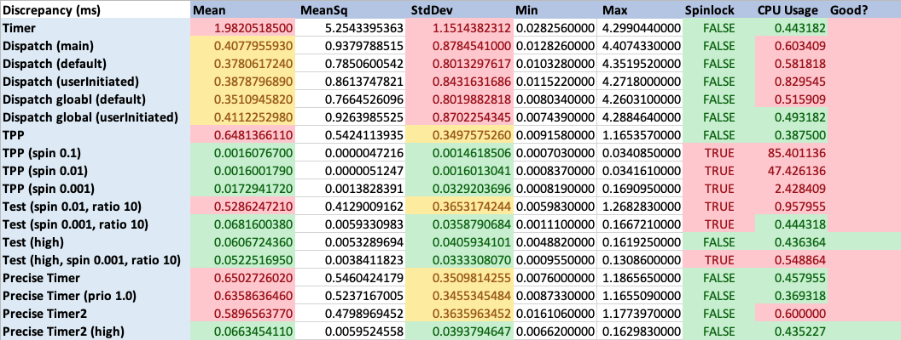
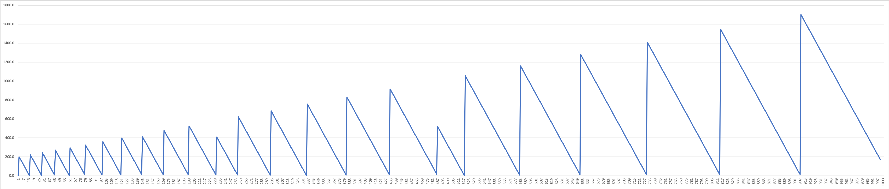
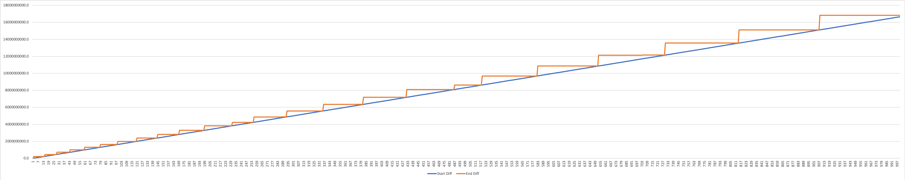
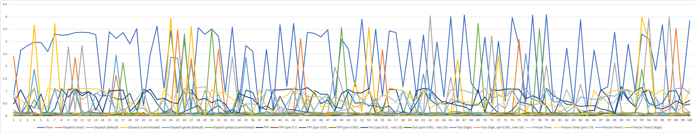
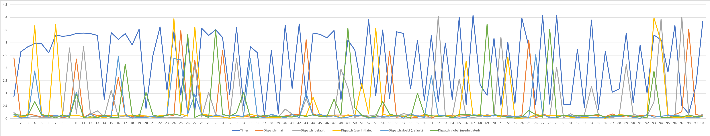
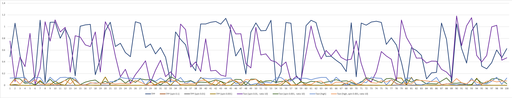
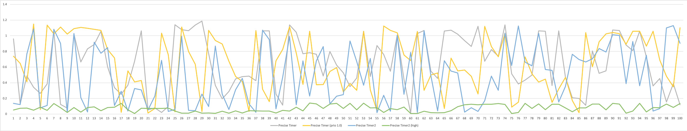
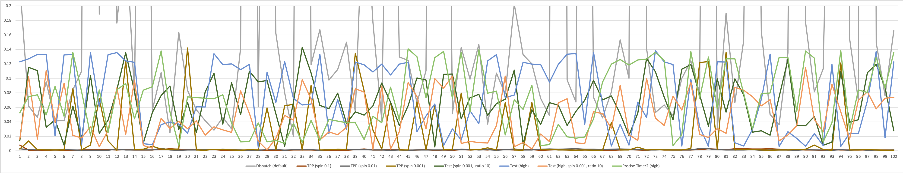

# macOS Precise Timing Test
Tests to find the most precise and efficient timer.

## Used Methods

- **Timer:** Foundation's simple [Timer](https://developer.apple.com/documentation/foundation/timer)
- **Dispatch:** [Dispatch](https://developer.apple.com/documentation/DISPATCH) Framework. main, dedicated and global queue with different qos. ([asyncAfter](https://developer.apple.com/documentation/dispatch/dispatchqueue/2300020-asyncafter))
- **TPP:** Michael Tyson's [TPPreciseTimer](http://atastypixel.com/blog/experiments-with-precise-timing-in-ios/)
- **Test:** Some of my changes based on TPP
- **Precise Timer:** My Timer that uses Foundation's simple [Thread](https://developer.apple.com/documentation/foundation/thread)
- **Precise Timer2:** My Timer that uses pthreads

## Resources

- Mach Absolute Time [explanation](https://developer.apple.com/library/archive/qa/qa1398/_index.html)
- [Mach Scheduling and Thread Interfaces](https://developer.apple.com/library/archive/documentation/Darwin/Conceptual/KernelProgramming/scheduler/scheduler.html#//apple_ref/doc/uid/TP30000905-CH211-BEHJDFCA)
- [thread_policy.h](https://opensource.apple.com/source/xnu/xnu-124.7/osfmk/mach/thread_policy.h.auto.html) with some explanations for certain structs

## Testing

1000 samples were taken per method. 1 sample is the difference between expected time and the actual time the timer fired. Standard measures were calculated like standard deviation, mean, mean square, min and max. Every method was tested for its CPU usage.

For timing and waiting the `mach_absolute_time()` and `mach_wait_until()` functions were used respectively. They are part of the most precise and low level API recommended by Apple, see Resources above.

Furthermore high precision Timers/Threads are also [recommended](https://developer.apple.com/library/archive/technotes/tn2169/_index.html) by Apple, for multimedia Apps or games. Basically everything that needs accurate timing. Methods that use such a Thread are marked as `high`, also see the Legende below.

## Legende

- **main:** Main Dispatch Queue
- **default:** Default qos for Dispatch Queues
- **userInitiated:** Higher priority qos for Dispatch Queues
- **spin X:** Spinlock with X seconds
- **ratio X:** Only spinlock up to X times
- **prio X:** Thread priority
- **high:** A [high precision](https://developer.apple.com/library/archive/technotes/tn2169/_index.html) pthread

## Statistics

| Discrepancy (ms)                        | Mean        |  MeanSq      |  StdDev      | Min      |  Max     | Spin               | CPU     | 
|-----------------------------------------|-------------|--------------|--------------|----------|----------|--------------------|---------| 
| **Timer**                               | 1.982051850 | 5.2543395363 | 1.1514382312 | 0.028256 | 4.299044 | :x:                | 0.4431  | 
| **Dispatch (main)**                     | 0.407795593 | 0.9379788515 | 0.8784541000 | 0.012826 | 4.407433 | :x:                | 0.6034  | 
| **Dispatch (default)**                  | 0.378061724 | 0.7850600542 | 0.8013297617 | 0.010328 | 4.351952 | :x:                | 0.5818  | 
| **Dispatch (userInitiated)**            | 0.387879689 | 0.8613747821 | 0.8431631686 | 0.011522 | 4.271800 | :x:                | 0.8295  | 
| **Dispatch global (default)**           | 0.351094582 | 0.7664526096 | 0.8019882818 | 0.008034 | 4.260310 | :x:                | 0.5159  | 
| **Dispatch global (userInitiated)**     | 0.411225298 | 0.9263985525 | 0.8702254345 | 0.007439 | 4.288464 | :x:                | 0.4931  | 
| **TPP**                                 | 0.648136611 | 0.5424113935 | 0.3497575260 | 0.009158 | 1.165357 | :x:                | 0.3875  | 
| **TPP (spin 0.1)**                      | 0.001607670 | 0.0000047216 | 0.0014618506 | 0.000703 | 0.034085 | :heavy_check_mark: | 85.401  | 
| **TPP (spin 0.01)**                     | 0.001600179 | 0.0000051247 | 0.0016013041 | 0.000837 | 0.034161 | :heavy_check_mark: | 47.426  | 
| **TPP (spin 0.001)**                    | 0.017294172 | 0.0013828391 | 0.0329203696 | 0.000819 | 0.169095 | :heavy_check_mark: | 2.4284  | 
| **Test (spin 0.01, ratio 10)**          | 0.528624721 | 0.4129009162 | 0.3653174244 | 0.005983 | 1.268283 | :heavy_check_mark: | 0.9579  | 
| **Test (spin 0.001, ratio 10)**         | 0.068160038 | 0.0059330983 | 0.0358790684 | 0.001110 | 0.166721 | :heavy_check_mark: | 0.4443  | 
| **Test (high)**                         | 0.060672436 | 0.0053289694 | 0.0405934101 | 0.004882 | 0.161925 | :x:                | 0.4363  | 
| **Test (high, spin 0.001, ratio 10)**   | 0.052251695 | 0.0038411823 | 0.0333308070 | 0.000955 | 0.130860 | :heavy_check_mark: | 0.5488  | 
| **Precise Timer**                       | 0.650272602 | 0.5460424179 | 0.3509814255 | 0.007600 | 1.186565 | :x:                | 0.4579  | 
| **Precise Timer (prio 1.0)**            | 0.635863646 | 0.5237167005 | 0.3455345484 | 0.008733 | 1.165509 | :x:                | 0.3693  | 
| **Precise Timer2**                      | 0.589656377 | 0.4798969452 | 0.3635963452 | 0.016106 | 1.177397 | :x:                | 0.6000  | 
| **Precise Timer2 (high)**               | 0.066345411 | 0.0059524558 | 0.0393794647 | 0.006620 | 0.162983 | :x:                | 0.4352  | 
 

My personal goal was to make a timer that is more precise than the Core Video's [CVDisplayLink](https://developer.apple.com/documentation/corevideo/cvdisplaylink-k0k) and its callback, to make display timing more precise (the reason why a 60Hz period was used for the tests). From personal tests the DisplayLink timings are most similar to a default priority Thread, eg the statistics to `TPP`, `Precise Timer` and `Precise Timer2` (without anything special done), because of that anything worse than those results can be safely discarded. With that being said, any mean discrepancy higher than 0.5 is regarded completely useless and anything higher than 0.1 is less useful. Only means below 0.1 are considered good enough. Furthermore, the same hold true for the standard deviation. Which only leaves us with 7 possible methods/combinations.

This basically renders the standard Timer and the Dispatch Queue completely useless, since they worsen the de facto standard.

Another criteria to chose a proper method is the CPU usage. All the plain spinlock ones generate a significant amount if CPU usage. They range from 6 times to up to 213 times of the usual amount, `TPP (spin 0.1)` (85.4%), `TPP (spin 0.01)` (47.42%) and `TPP (spin 0.001)` (2.42%). I consider these method not too useful due to that. Though one has to mention, if you really need a very precise timer a spinlock of 0.01 seconds has the very best accuracy with a relative mild CPU usage. The spinlock method were a bit refined by adding an upper limit of how many loops it does at max (10 times). This reduced the CPU usage significantly but also decreased its accuracy. They are just a little bit more accurate than the high priority Threads, which is might be just a natural fluctuation in the measurement.

This only leaves us with the high priority Timers, which use the least amount of CPU and are still very accurate, around 10 times as accurate.

## Observations

There are also one weird observation i made.

### Dispatch Queue

The Dispatch Queue has one weird quirk. When only one dispatch queue is doing work and several timely close events are being queued, those events are grouped depending on the idle time. This makes the Dispatch Queue even more useless, even though i could work around it.

I found that problem after i looked at the weird statistics that were returned by my tests. Below the first image shows a weird saw pattern of the discrepancy that was measured between expected and actual time. The second image shows the expected event time (blue) and when the timer fired (orange).
The longer an event is idling in the queue the more timely close events are being grouped together and fire at similar times. Very undesirable behaviour for my use cases.

## Graphs

Not too important, though i am still adding the plotted graphs of the different methods.

#### All

#### Dispatch

#### TPP

#### Precise Timer

#### Assorted

## Attachments

Attached is the excel [file](timer_stats.xlsx) with the statistics and the graphs.